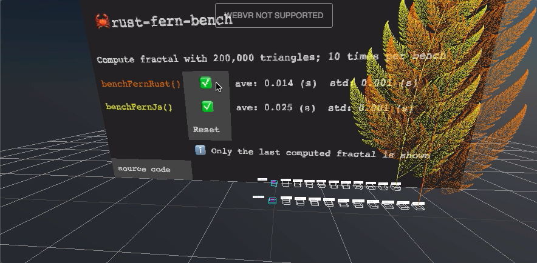

### Building wasm files

First, make sure the <a href="https://rustwasm.github.io/wasm-pack/installer/" target="_blank" rel="noopener">wasm-pack</a> command is
installed in the system.  Then, build `<name>_bg.wasm` and `<name>.exports.js` (where `<name>` is the Rust crate's name) as follows:

```sh
$ cd ../.. && npm install && cd -  # for the `wasm-compat` target in Makefile
$ make
```

### Demo

[](https://w3reality.github.io/threelet/examples/rust-fern-bench/index.html)
