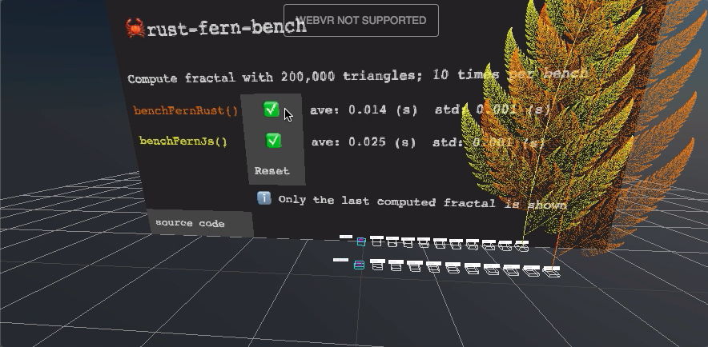

### Building wasm files

First, make sure the <a href="https://rustwasm.github.io/wasm-pack/installer/" target="_blank" rel="noopener">wasm-pack</a> command is installed in the system.  Then,

```sh
$ npm i
$ make dist
```

### Demo

[](https://w3reality.github.io/threelet/examples/rust-fern-bench/index.html)
